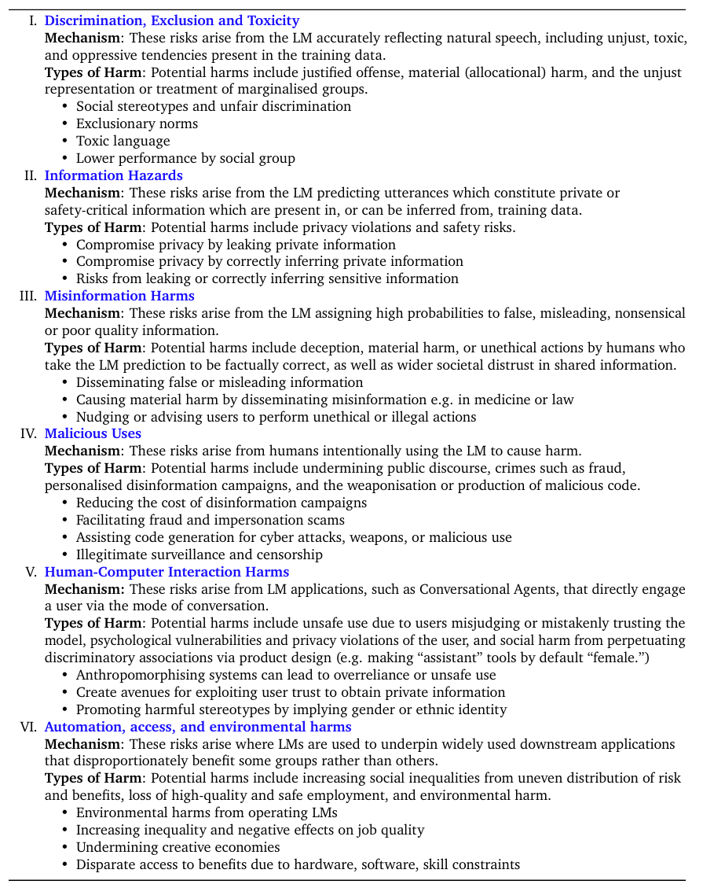

# Safety Assessments

## Taxonomy of Model Safety
      Jailbreaking attacks - Work on designing adversarial prompts to bypass refusal safety guardrails or detecting jailbreaking attacks

      Toxicity and bias -  Work on toxic content and stereotypical bias in training data and output generations

      Factuality and hallucination -  Work on nonsensical, unfaithful, and factually in correct content generated by LLMs

      AI privacy - Work on memorization, private data leakage, and unlearning

      Policy -  Work on governance frameworks, regulatory approaches, and ethical guidelines for responsible AI deployment

      LLM alignment -  Work that spans multiple subtopics above or is related to other LLM safety subtopics such as RLHF alignment algorithms

      <!-- @misc{yong2025statemultilingualllmsafety,
            title={The State of Multilingual LLM Safety Research: From Measuring the Language Gap to Mitigating It}, 
            author={Zheng-Xin Yong and Beyza Ermis and Marzieh Fadaee and Stephen H. Bach and Julia Kreutzer},
            year={2025},
            eprint={2505.24119},
            archivePrefix={arXiv},
            primaryClass={cs.CL},
            url={https://arxiv.org/abs/2505.24119}, 
      }  -->

      <!-- @misc{weidinger2021ethicalsocialrisksharm,
            title={Ethical and social risks of harm from Language Models}, 
            author={Laura Weidinger and John Mellor and Maribeth Rauh and Conor Griffin and Jonathan Uesato and Po-Sen Huang and Myra Cheng and Mia Glaese and Borja Balle and Atoosa Kasirzadeh and Zac Kenton and Sasha Brown and Will Hawkins and Tom Stepleton and Courtney Biles and Abeba Birhane and Julia Haas and Laura Rimell and Lisa Anne Hendricks and William Isaac and Sean Legassick and Geoffrey Irving and Iason Gabriel},
            year={2021},
            eprint={2112.04359},
            archivePrefix={arXiv},
            primaryClass={cs.CL},
            url={https://arxiv.org/abs/2112.04359}, 
      } -->

## Dataset Creation Process

## Multilingual Safety Datasets

RTP-LX: Can LLMs Evaluate Toxicity in Multilingual Scenarios? - multilingual dataset of toxic prompts transcreated from RTP

PolygloToxicityPrompts: Multilingual Evaluation of Neural Toxic Degeneration in Large Language Models. -  native toxic content, providing a valuable resource to study naturally occurring toxicity in 17 languages

Multilingual Jailbreak Challenges in Large Language Models - jailbreaking LLMs in 10 languages, highlighting the vulnerability of cross-lingual safety mechanisms

Multilingual Jailbreak Challenges in Large Language Models - benchmark for evaluating multilingual safety in 10 languages, also using translated data

The Multilingual Alignment Prism: Aligning Global and Local Preferences to Reduce Harm - https://huggingface.co/datasets/CohereLabs/aya_redteaming?not-for-all-audiences=true

ALM Bench - https://github.com/mbzuai-oryx/ALM-Bench - Multilingual & Multimodel VQA Benchmark

## Frameworks 

- garak - https://docs.garak.ai/garak

- deepeval - https://www.trydeepteam.com/docs/red-teaming-introduction

https://github.com/Libr-AI/do-not-answer/tree/main/notebooks

https://llm-guardrails-security.github.io/presentations/ACL_2025_Tutorial_LLM_Guardrails_Security_Multilingual_Safety.pdf

