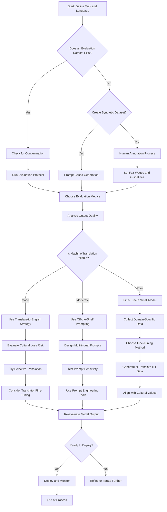

# Playbook Flowchart

```mermaid
flowchart TD

  A[Start: Define Task and Language] --> B{Does an Evaluation Dataset Exist?}
  B -- Yes --> B1[Check for Contamination]
  B1 --> B2[Run Evaluation Protocol]
  B2 --> B3[Choose Evaluation Metrics]
  B3 --> B4[Analyze Output Quality]

  B -- No --> C{Create Synthetic Dataset?}
  C -- Yes --> C1[Prompt-Based Generation]
  C1 --> B3
  C -- No --> C2[Human Annotation Process]
  C2 --> C3[Set Fair Wages and Guidelines]
  C3 --> B3

  B4 --> D{Is Machine Translation Reliable?}
  D -- Good --> D1[Use Translate-to-English Strategy]
  D -- Moderate --> D2[Use Off-the-Shelf Prompting]
  D -- Poor --> D3[Fine-Tune a Small Model]

  D1 --> D1a[Evaluate Cultural Loss Risk]
  D1a --> D1b[Try Selective Translation]
  D1b --> D1c[Consider Translator Fine-Tuning]

  D2 --> D2a[Design Multilingual Prompts]
  D2a --> D2b[Test Prompt Sensitivity]
  D2b --> D2c[Use Prompt Engineering Tools]

  D3 --> D3a[Collect Domain-Specific Data]
  D3a --> D3b[Choose Fine-Tuning Method]
  D3b --> D3c[Generate or Translate IFT Data]
  D3c --> D3d[Align with Cultural Values]

  D1c --> E[Re-evaluate Model Output]
  D2c --> E
  D3d --> E

  E --> F{Ready to Deploy?}
  F -- Yes --> G[Deploy and Monitor]
  F -- No --> H[Refine or Iterate Further]

  G --> I[End of Process]
```
