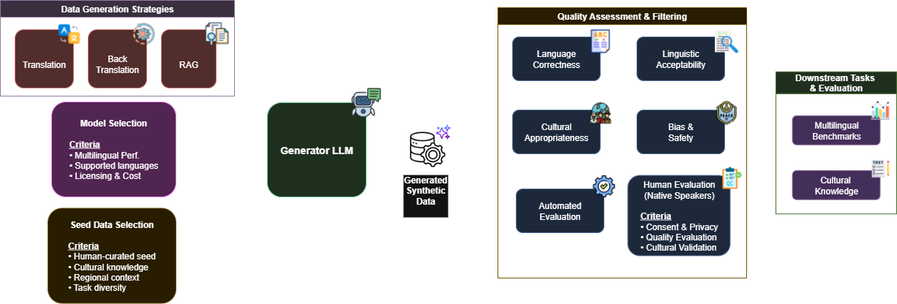

## 6.1 Strategic approaches to synthetic data generation

The generation of high-quality multilingual synthetic data requires careful consideration of both technical methodology and linguistic authenticity. Two primary strategic approaches have emerged, each with distinct advantages and use cases.

### 6.1.1 Top-down translation approach

The **top-down paradigm** represents the most straightforward approach to multilingual synthetic data generation: translating existing high-quality English datasets into target languages.

!!! info "Top-Down Methodology"
    **Process:**
    1. Source high-quality English instruction datasets (e.g., Alpaca, Dolly, WizardLM)
    2. Apply machine translation or LLM-based translation
    3. Post-process for linguistic quality and consistency
    4. Validate through automated metrics and sampling
    
    **Advantages:**
    - **Rapid deployment** with minimal setup requirements
    - **Proven quality baseline** from established English datasets
    - **Cost-effective scaling** across multiple languages simultaneously
    - **Consistent structure** maintaining original dataset organization

!!! warning "Top-Down Limitations"
    **Cultural Hollow Effect**  
    Translation preserves linguistic form but loses cultural substance—resulting in technically correct but culturally irrelevant content
    
    **Translation Artifacts**  
    Systematic translation errors can propagate across the entire dataset
    
    **Domain Mismatch**  
    English-centric examples may not reflect target language cultural contexts or domain knowledge

### 6.1.2 Bottom-up cultural grounding

The **bottom-up approach** generates data directly in target languages using culturally relevant sources and context-aware prompting strategies.

!!! success "Bottom-Up Excellence: The Updesh Framework"
    **Recent breakthrough research** (Chitale et al., 2025) demonstrates the superior effectiveness of bottom-up generation through the **Updesh dataset**—a large-scale synthetic instruction-following dataset comprising **9.5M data points across 13 Indian languages**.
    
    **Key Innovation:** Grounding data generation in **language-specific Wikipedia content** rather than translating from English sources.

#### The Updesh methodology

The Updesh framework represents a paradigm shift in multilingual synthetic data generation, leveraging large open-source LLMs (≥235B parameters) with culturally-grounded prompting:

!!! info "Bottom-Up Generation Process"
    **1. Cultural Context Seeding**  
    Use language-specific Wikipedia articles as cultural and factual grounding for generation prompts
    
    **2. Context-Aware Prompting**  
    Craft prompts that explicitly reference local cultural contexts, historical events, and domain knowledge
    
    **3. Multi-Turn Capability Development**  
    Generate long-context, multi-turn conversations that reflect authentic linguistic patterns
    
    **4. Diverse Task Coverage**  
    Cover reasoning, generative tasks, and instruction-following with cultural authenticity

#### Empirical evidence for bottom-up superiority

The Updesh research provides compelling evidence for the effectiveness of culturally-grounded generation:

!!! success "Proven Performance Gains"
    **Downstream Evaluation Results:**
    - **Significant improvements** on generative tasks across 15 multilingual datasets
    - **Competitive performance** on multiple-choice NLU tasks
    - **Most pronounced gains** in low and medium-resource languages
    - **Narrowed performance gap** between high-resource and low-resource languages

### 6.1.3 Understanding generation paradigms

!!! info "Generation Strategy Selection"
    The choice between top-down and bottom-up approaches should be driven by:
    
    - **Available seed data** in the target language
    - **Domain complexity** and required specialization
    - **Quality requirements** and evaluation capabilities
    - **Resource constraints** (computational and human)
    - **Cultural authenticity requirements**

**Hybrid Strategies** can effectively combine both approaches, using top-down methods for rapid prototyping and bottom-up methods for cultural refinement and specialized domains.

